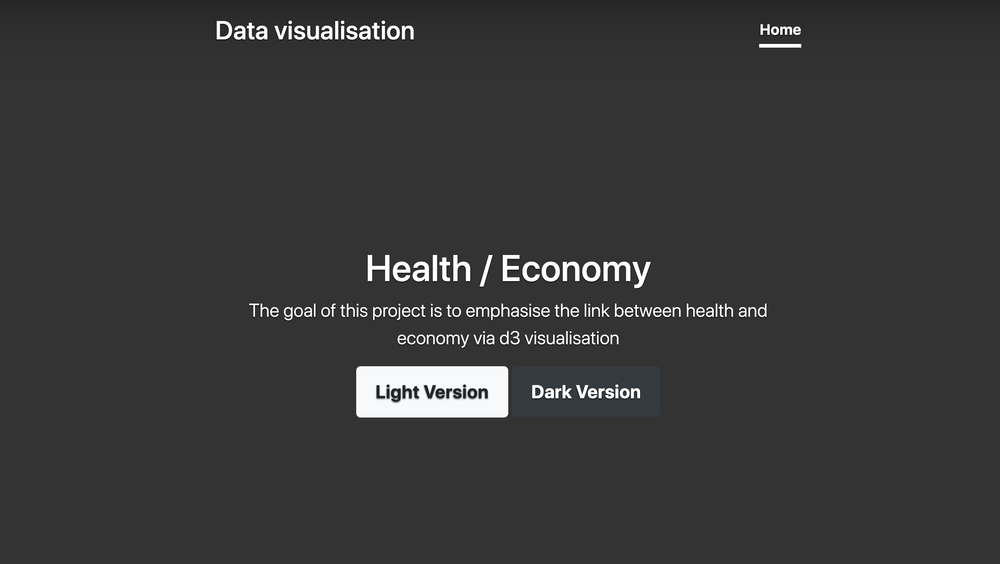
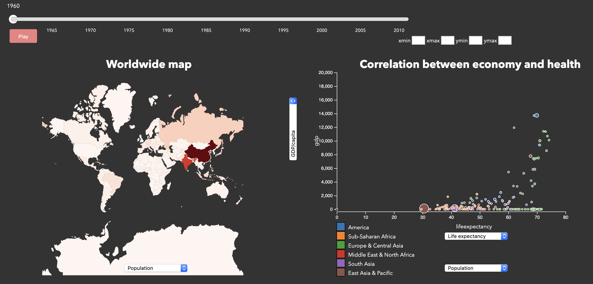
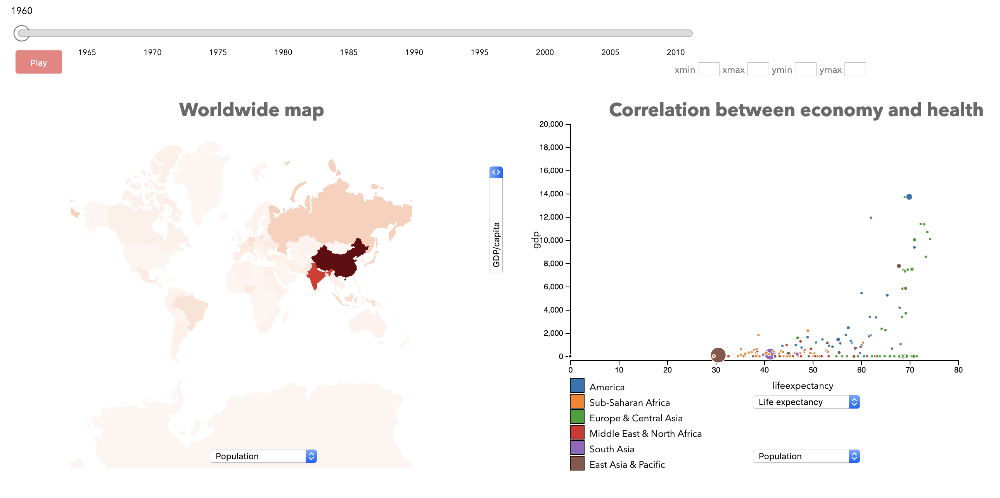

# Data visualisation project

The goal of this project is to emphasise the link between health and economy via d3 visualisation.
It has been developed by Alexis Ipanema, Benoit Sarrauste, Guillaume Quispe. 

</img>
</img>
</img>
